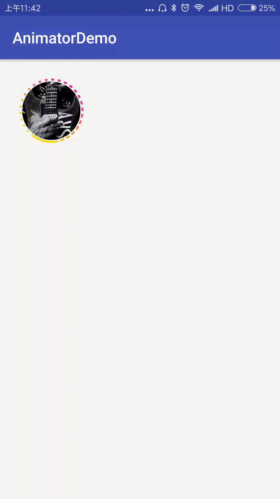

[中文文档](https://github.com/qintong91/InsLoadingAnimation/blob/master/README-zh.md)<br/>
# InsLoadingAnimation
[](https://www.apache.org/licenses/LICENSE-2.0)
[](https://bintray.com/qintong000/maven/insLoadingAnimation/_latestVersion)
[](https://android-arsenal.com/details/1/5789)

## Introduction
InsLoadingAnimation is imitation of instagram and weibo avator animation of loading for Android. More information and code analysis please see blog: http://www.jianshu.com/p/a0e2dbeef88a

## Demo


## Usage

### Step 1

Add dependencies in build.gradle.

```
dependencies {
  compile 'com.qintong:insLoadingAnimation:1.1.0'
}
```

### Step 2

InsLoadingView is extands ImageView, it can be used like ImageView simply.

```xml
<com.qintong.library.InsLoadingView
    android:layout_centerInParent="true"
    android:id="@+id/loading_view"
    android:layout_width="wrap_content"
    android:layout_height="wrap_content"
    android:src="@mipmap/pink"/>
```

### Step 3

#### Set status of InsLoadingView
You can change the status of InsLoadingView manually to match up it's status in your context.
The status of InsLoadingView:
LOADING: to show this InsLoadingView has been clicked and before it has been loaded, animation of circle is running.
UNCLICKED: to show this InsLoadingView neither has been clicked nor loaded, the animation of circle is stopped.
CLICKED: to show this InsLoadingView has been clicked and loaded, the animation of circle is stopped and the color of the circle is gray.
The default status is LOADING.
Set status of InsLoadingView only requires the following code:

xml:
```xml
  app:status="loading" //or "clicked",or "clicked"
```

java:
```java
  mInsLoadingView.setStatus(InsLoadingView.Status.LOADING); //Or InsLoadingView.Status.CLICKED, InsLoadingView.Status.UNCLICKED
```

#### Set the color of InsLoadingView
You can set the start color and end color, the circle of InsLoadingView will show the transition of this two colors:

xml:
```xml
  app:start_color="#FFF700C2" //or your color
  app:end_color="#FFFFD900" //or your color
```

java:
```java
  mInsLoadingView.setStartColor(Color.YELLOW); //or your color
  mInsLoadingView.setEndColor(Color.BLUE); //or your color
```
The default start color and end color is #FFF700C2 and #FFFFD900.

#### Set the speed of InsLoadingView.

You can change the speed of animation by set the circle animation duration or whole animation rotating duration(MS):

xml:
```xml
  app:circle_duration="2000"
  app:rotate_duration="10000"
```

java:
```java
  mInsLoadingView.setCircleDuration(2000);
  mInsLoadingView.setRotateDuration(10000);
```
The default circle duration and rotate duration is 2000ms and 10000ms.

## Contact me

[Email](mailto:qintong5900@163.com)

[My Blog](http://www.jianshu.com/u/d2b8b611095d)

### License
```
Copyright 2017 Qin Tong

Licensed under the Apache License, Version 2.0 (the "License");
you may not use this file except in compliance with the License.
You may obtain a copy of the License at

   http://www.apache.org/licenses/LICENSE-2.0

Unless required by applicable law or agreed to in writing, software
distributed under the License is distributed on an "AS IS" BASIS,
WITHOUT WARRANTIES OR CONDITIONS OF ANY KIND, either express or implied.
See the License for the specific language governing permissions and
limitations under the License.
```
